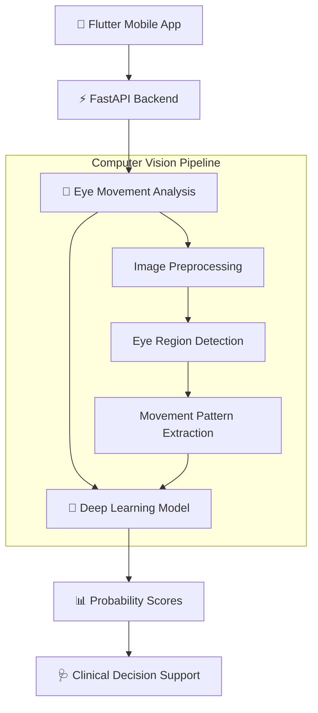

<div align="center">

# 🔬 Medical Eye Muscle Detection System

### AI-Powered Diagnostic Tool for Ophthalmology

[](https://python.org)
[](https://opencv.org)
[](https://fastapi.tiangolo.com)
[](https://flutter.dev)
[](LICENSE)

*An AI diagnostic system to automatically classify which eye muscle is impaired, replicating a process traditionally performed manually by ophthalmologists.*

[Features](#features) · [Architecture](#architecture) · [Installation](#installation) · [Usage](#usage) · [Thesis](#thesis)

</div>

---

## 📋 Overview

This is my **Graduation Project** at Pharos University in Alexandria (Jan 2026 – Present). The system uses computer vision and deep learning to analyse eye movement patterns and classify impaired extraocular muscles, providing ranked probability scores to assist ophthalmologists in their diagnostic process.

## ✨ Features

- 🎯 **Automated Muscle Classification** — AI-powered detection of impaired eye muscles from movement patterns
- 📊 **Probability Ranking** — Outputs ranked probability scores per muscle for clinical decision support
- 🔬 **Computer Vision Pipeline** — Custom pipeline for eye movement pattern analysis using OpenCV
- 📱 **Cross-Platform App** — Flutter mobile application for easy clinical use
- ⚡ **FastAPI Backend** — High-performance REST API for model inference
- 📄 **IEEE Documentation** — Full 5-chapter IEEE-formatted thesis

## 🏗️ Architecture



## 🗂️ Project Structure

```
Medical-Eye-Muscle-Detection/
├── backend/
│   ├── app/
│   │   ├── main.py              # FastAPI application entry point
│   │   ├── models/
│   │   │   ├── eye_model.py     # Deep learning model definition
│   │   │   └── schemas.py       # Pydantic schemas
│   │   ├── services/
│   │   │   ├── detector.py      # Eye detection service
│   │   │   ├── analyzer.py      # Movement analysis service
│   │   │   └── classifier.py    # Muscle classification service
│   │   ├── utils/
│   │   │   ├── preprocessing.py # Image preprocessing utilities
│   │   │   └── visualization.py # Result visualization
│   │   └── config.py            # Configuration settings
│   ├── models/                  # Trained model weights
│   ├── requirements.txt
│   └── Dockerfile
├── mobile/
│   └── flutter_app/             # Flutter cross-platform application
├── data/
│   ├── raw/                     # Raw dataset
│   └── processed/               # Preprocessed data
├── notebooks/
│   ├── 01_data_exploration.ipynb
│   ├── 02_model_training.ipynb
│   └── 03_evaluation.ipynb
├── thesis/                      # IEEE-formatted thesis documents
├── docs/                        # Additional documentation
├── LICENSE
└── README.md
```

## 🚀 Installation

### Prerequisites
- Python 3.9+
- Flutter SDK
- CUDA-compatible GPU (recommended)

### Backend Setup
```bash
# Clone the repository
git clone https://github.com/mahmodelmalah/Medical-Eye-Muscle-Detection.git
cd Medical-Eye-Muscle-Detection/backend

# Create virtual environment
python -m venv venv
source venv/bin/activate  # or venv\Scripts\activate on Windows

# Install dependencies
pip install -r requirements.txt

# Run the API server
uvicorn app.main:app --reload --port 8000
```

### Mobile App
```bash
cd mobile/flutter_app
flutter pub get
flutter run
```

## 📄 Thesis

This project includes a comprehensive **5-chapter IEEE-formatted thesis** covering:
1. Introduction & Literature Review
2. Methodology & System Design
3. Dataset Construction & Preprocessing
4. Model Architecture & Training
5. Results, Evaluation & Conclusion

## 📬 Contact

**Mahmoud Elmalah** — [mahmodcool5@gmail.com](mailto:mahmodcool5@gmail.com)

[](https://mahmodelmalah.github.io/portfolio)
[](https://linkedin.com/in/mahmoud-elmalah)

## 📝 License

This project is licensed under the MIT License — see the [LICENSE](LICENSE) file for details.
